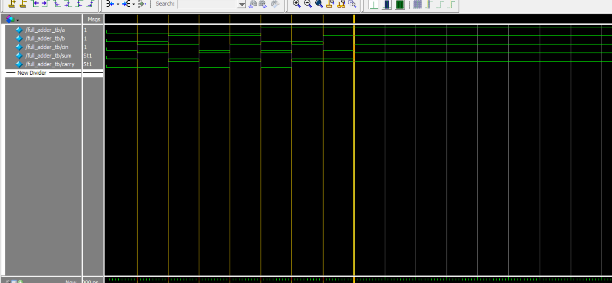

# Verilog Full Adder Simulation

This project simulates a 1-bit Full Adder in Verilog, including waveform output and log monitoring.

## 🔧 Files
- `full_adder.v` – Verilog module for Full Adder
- `full_adder_tb.v` – Testbench for simulation
- `monitor_log.txt` – Simulation output log
- `full_adder.vcd` – Value Change Dump file for waveform
- `wave_full_adder_tb.png` – Waveform screenshot from ModelSim

## ✅ Logic
- **Sum = A ⊕ B ⊕ Cin**
- **Carry = AB + ACin + BCin**

## 📷 Simulation Result

